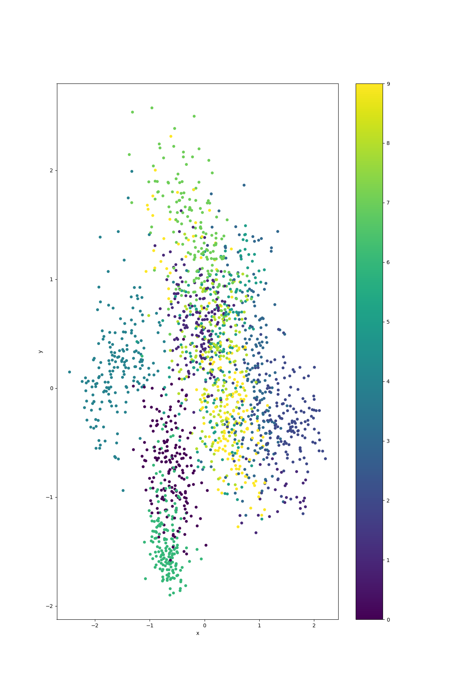

# Beta-Variational-Autoencoder
Simple Beta-VAE using scikit-learn API, made mostly by prompting GPT-4.
With a single argument this can instead be a regular autoencoder (no variational).
The [VeLO optimizer](https://github.com/janEbert/PyTorch-VeLO) can be used (apparently only on cpu and not on cuda?)

# Example result on handwritten digits:


## Notes
* There are 2 compression layers and the decompression is symetrical.
* A wrapper called `OptimizedBVAE` can be used to do a grid search over the hidden_dim parameters then return the best model after further training.


The optimizer used is AdamW, but `VeLO` can be used from [this repo](https://github.com/janEbert/PyTorch-VeLO).

## Usage
```
from bvae import ReducedBVAE
model = ReducedBVAE(
    input_dim,
    z_dim,  # lowest nmuber of dimension
    hidden_dim,  # number of neurons in the 2nd layer of the compression
    dataset_size,
    lr=1e-3,
    epochs=1000,
    beta=1.0,
    weight_decay=0.01,
    use_VeLO=False,
    use_scheduler=True,
    )
model.prepare_dataset(
    dataset=dataset,
    val_ratio=0.2,
    batch_size=500,
)
model.train_bvae(
    patience=100,
)
projection = model.transform(dataset)
```
